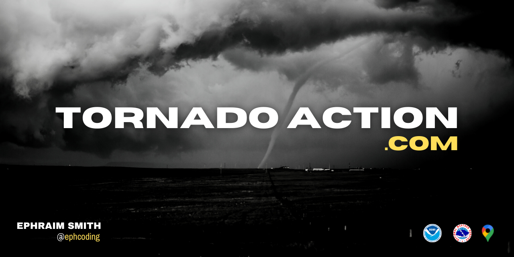

  <a href='https://www.ephcoding.com'>ephcoding.com</a> |
  <a href='https://github.com/ephcoding'>github</a> |
  <a href='https://linkedin.com/in/ephraimjsmith'>linkedin</a> |
  <a href='https://twitter.com/ephcoding'>twitter</a>

 

# **`ACTIVE PROJECTS`**

**Personal Software Blog | [ephcoding.com](https://www.ephcoding.com) | [repo](https://github.com/ephcoding/site__ephcoding-dot-com)**

**Severe Weather Data Visualization | [tornadoaction.com](https://www.tornadoaction.com) | [repo](https://github.com/ephcoding/app__tornado-action)**

# **`RESUME`**

