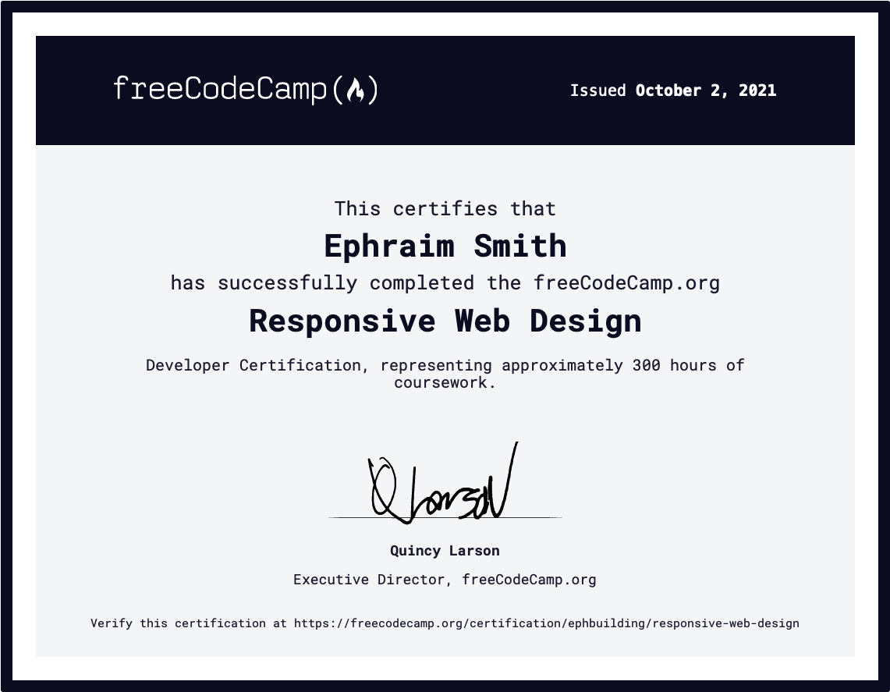
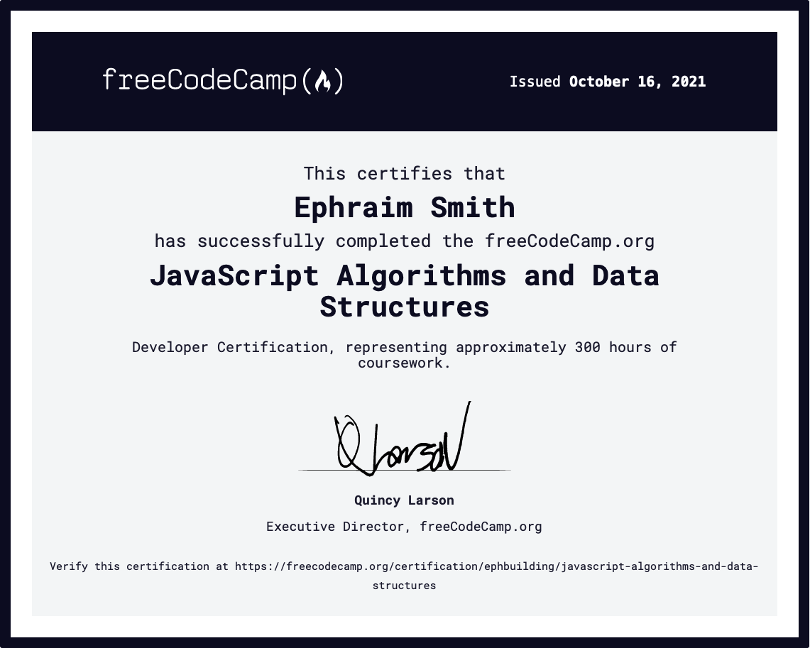
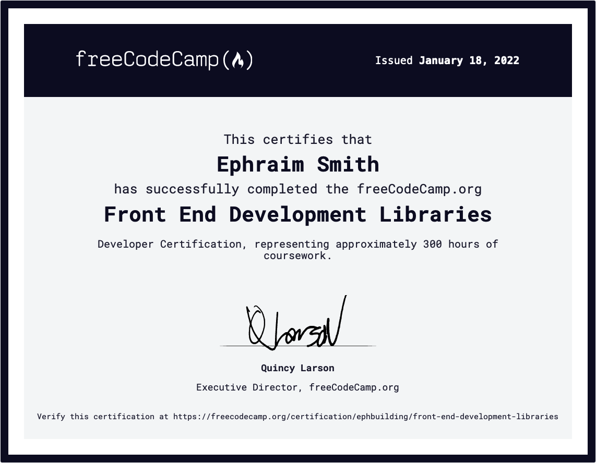

# **EPHRAIM SMITH**

  
  &nbsp;
  &nbsp;
  
  &nbsp;
  &nbsp;
  
  &nbsp;
  &nbsp;
  
  &nbsp;
  &nbsp;
  

 

## **_Experience Timeline_**

- 2018 | heavy equipment operator
- 2019 | graduated from [Tech Elevator](https://techelevator.com)'s 14-week fullstack Java bootcamp
- 2019 | lead QA/Automated Testing Engineer
- 2021 | earned FreeCodeCamp certificates: [Responsive Web Design](https://www.freecodecamp.org/certification/ephbuilding/responsive-web-design), [JavaScript Algorithms & Data Structures](https://www.freecodecamp.org/certification/ephbuilding/javascript-algorithms-and-data-structures), [Front End Development Libraries](https://www.freecodecamp.org/certification/ephbuilding/front-end-development-libraries)
- 2021 | reallocated 100% of my time to learning and building with React, Next.js, React Native, Postgres, Node.js
- 2022 | current projects: [ROVERCAM](https://rovercamapp.com), [tornadoaction.com](https://tornadoaction.com)

  &nbsp;
  &nbsp;
  &nbsp;
  &nbsp;
  &nbsp;
  &nbsp;
  &nbsp;
  &nbsp;
  &nbsp;
  &nbsp;
  &nbsp;
  &nbsp;
  &nbsp;
  &nbsp;
  

<table>
  <tr>    
    <td>
      
    </td>   
    <td>
      
    </td>
    <td>
      
    </td>
    <td>
      
    </td>
  </tr>
</table>

## **_Personal_**

- 6 yr old son / 3 yr old daughter
- ridden over 30,000 miles on motorcycles
- actively learning to skateboard
- taught myself to play guitar
- 1 hot air balloon ride
- 2 bungey jumps
- 127 skydives

## **_Objective_**

- join a team that:
  - has a mission focused on helping the end user
  - plays as hard as they work
  - values a strong work ethic
  - embraces accountability
  - works remote
