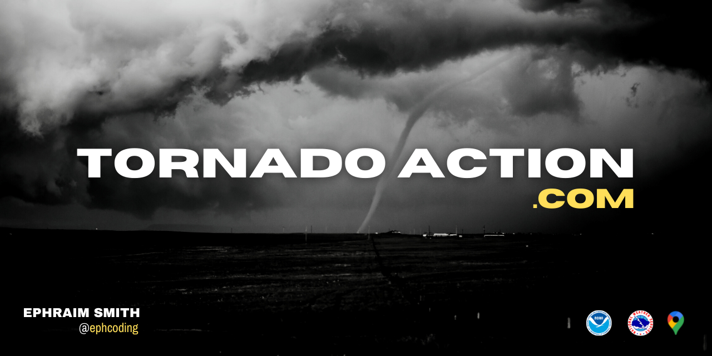

  <a href='https://www.ephcoding.com'>ephcoding.com</a> |
  <a href='https://github.com/ephcoding'>github</a> |
  <a href='https://linkedin.com/in/ephraimjsmith'>linkedin</a> |
  <a href='https://twitter.com/ephcoding'>twitter</a>

 

<em><strong>Thanks for checking out my code!  I know you're busy.  Hit me up if you have any questions!  :metal:</strong></em>

 

# **`INDEX`**

1. [Repos](#repos)
1. [Active Projects](#active-projects)
1. [Resume](#resume)

# **`REPOS`**

## Repos are organized into 4 groups:

- **`app`:** app (desktop, mobile, or web)
- **`ref`:** go-to references for different topics
- **`sbx`:** sandbox to quick-demo new concepts/snippets
- **`site`:** website

_**to see repos grouped by area, sort them by name:**_

# **`ACTIVE PROJECTS`**

<a href='#index'>^ back to top ^</a>

**Personal Software Blog | [ephcoding.com](https://www.ephcoding.com) | [repo](https://github.com/ephcoding/site__ephcoding-dot-com)**

**Severe Weather Data Visualization | [tornadoaction.com](https://www.tornadoaction.com) | [repo](https://github.com/ephcoding/app__tornado-action)**

# **`RESUME`**

<a href='#index'>^ back to top ^</a>

