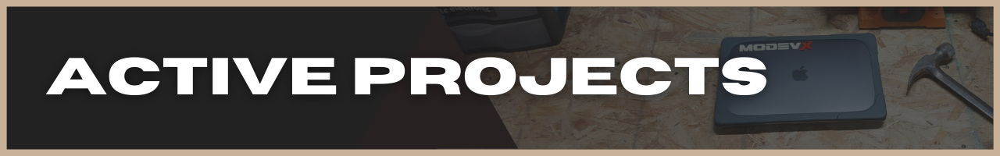
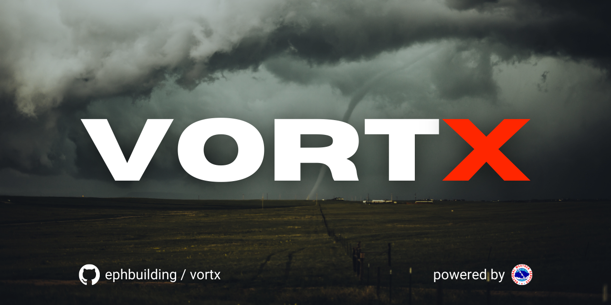
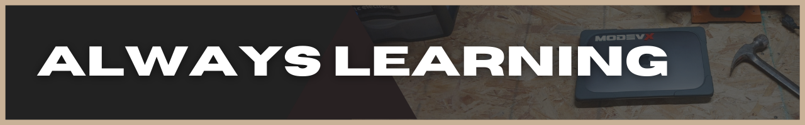
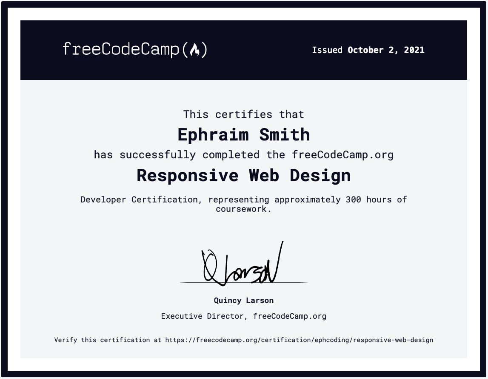
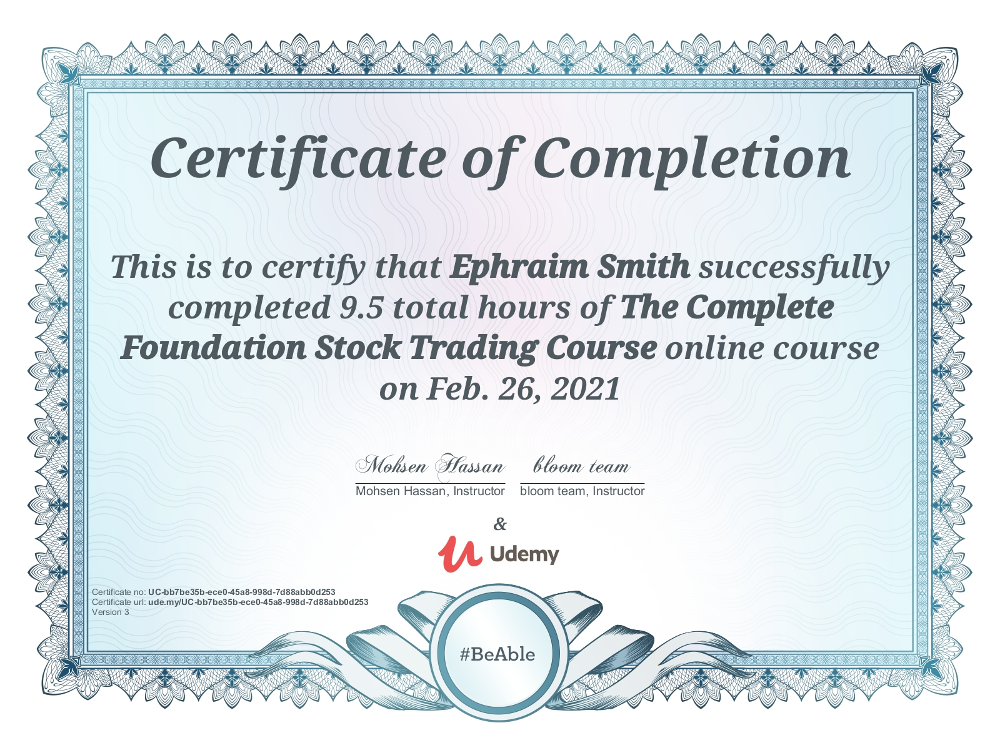
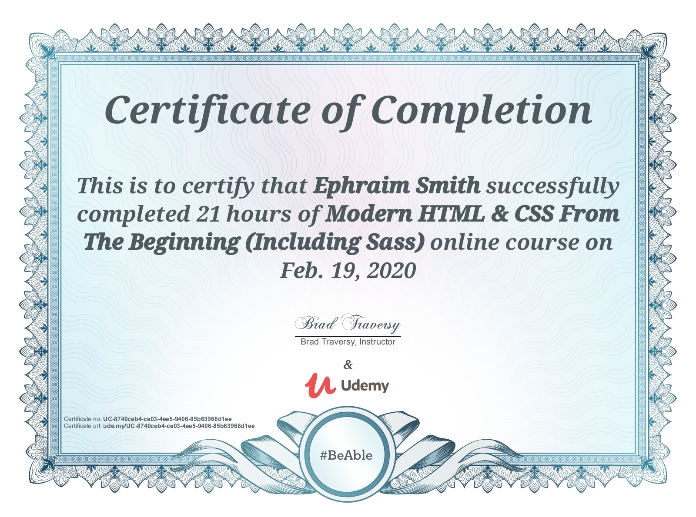

<table align='center'>
  <tr>
    <td width='200px'>
      
    </td>
    <td>
      <input type='checkbox' checked disabled> every active tornado alert in real-time</input>
       
      <input type='checkbox' disabled> latest tornado-related news & updates</input>
       
      <input type='checkbox' disabled> eye-popping tornado stat visualizations</input>    
       
       
      <strong><em>SEE IT <a href='https://tornadoaction.com' target='_blank'>LIVE</a></em></strong>&nbsp;&nbsp;&nbsp;&nbsp;&nbsp;<strong><em>SEE THE <a href='https://github.com/ephbuilding/tornado-action' target='_blank'>CODE</a></em></strong>
    </td>
  </tr>
  <tr>
    <td width='200px'>
      
    </td>
    <td>
      <input type='checkbox' disabled> PostgreSQL database with stats for 70 years/65,000+ tornadoes</input>
       
      <input type='checkbox' disabled> REST/GraphQL API</input>
           
       
      <strong><em>SEE IT <a href='https://github.com/ephbuilding/vortx' target='_blank'>CODE</a></em></strong>
    </td>
  </tr>
  <tr>
    <td width='200px'>
      
    </td>
    <td>
      <input type='checkbox' disabled> various trading strategy algorithms</input>
             
      <input type='checkbox' disabled> market indicator utilities</input>
       
      <input type='checkbox' disabled> order execution triggers</input>
           
       
      <strong><em>SEE THE <a href='https://github.com/ephbuilding/alstr' target='_blank'>CODE</a></em></strong>
    </td>
  </tr>
  <tr>
    <td width='200px'>
      
    </td>
    <td>
      <input type='checkbox' disabled> latest rover stats</input>
       
      <input type='checkbox' disabled> latest photos for each rover</input>
       
      <input type='checkbox' disabled> search a rover's photos by SOL (martian day)</input>
       
      <input type='checkbox' disabled> search a rover's photos by earth date</input>
       
       
      <strong><em>SEE THE <a href='https://github.com/ephbuilding/rovercam' target='_blank'>CODE</a></em></strong>
    </td>
  </tr>
</table>

  
  
  &nbsp;
  &nbsp;  
  
  &nbsp;
  &nbsp;
  

 

  <table>
    <tr>
      <td>
              
      </td>      
      <td>
        
      </td>
      <td>
        
      </td>
    </tr>
    <tr>
      <td>
        
      </td>
      <td>
              
      </td>
      <td>
        
      </td>      
    </tr>
    <tr>     
      <td>
        
      </td>      
    </tr>    
  </table>

  
  
  &nbsp;
  &nbsp;  
  
  &nbsp;
  &nbsp;
  

