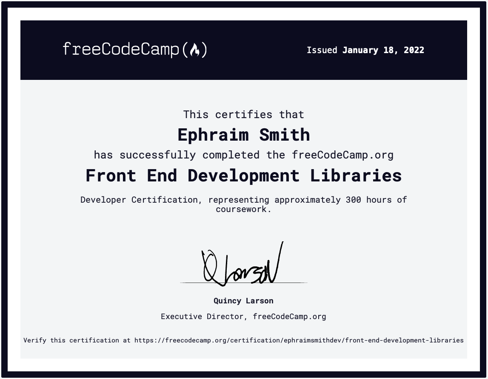
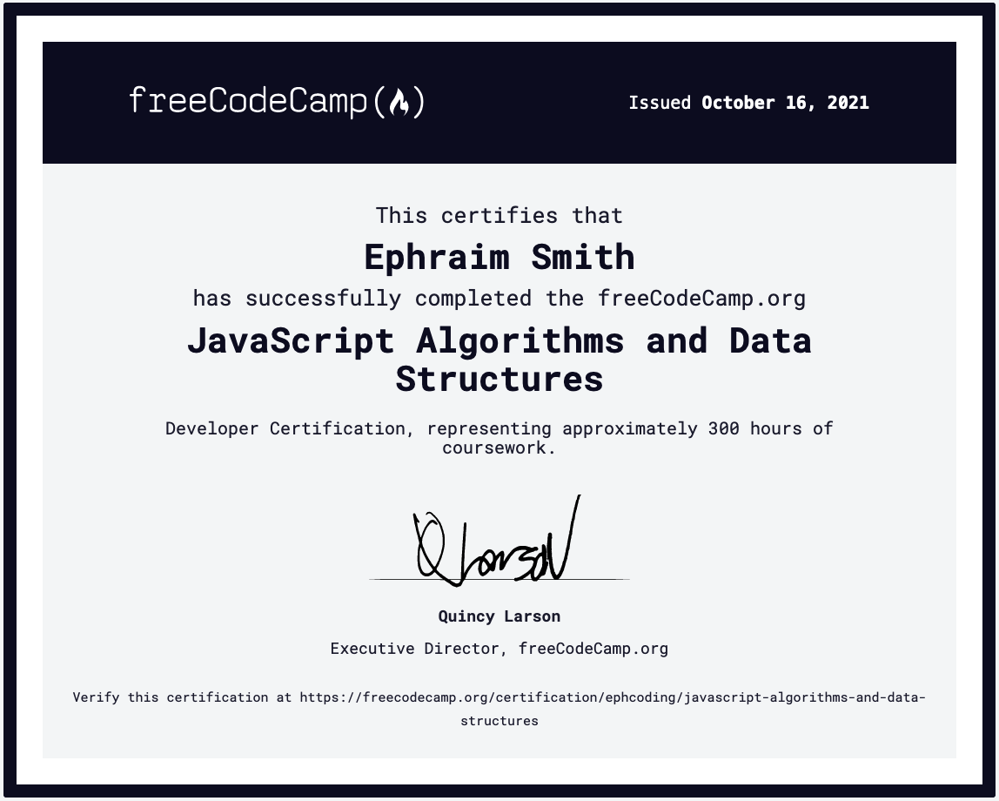
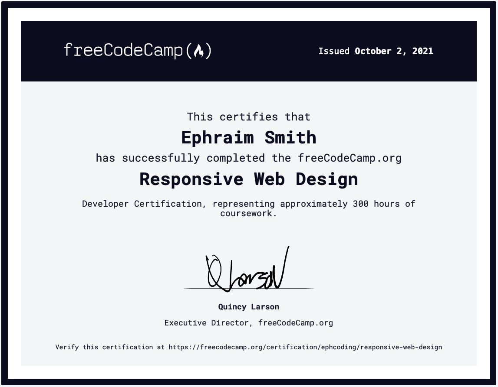

**updated**: _Jan 26, 2022_

I've invested a massive amount of time learning to code, so I really appreciate you taking the time to check out my stuff!

**_ANY_** and **_ALL_** feedback is appreciated too. So, if you have some, **_[SEND IT](mailto:feedback@ephraimsmith.dev)_**!

### **_WHAT:_**

[VORTX](https://github.com/ephraimsmithdev/vortx) is a REST API for getting stats on every recorded tornado since 1950.

### **_WHY:_**

I've never built an API before. Plus, [TORNADO ACTION](https://github.com/ephraimsmithdev/tornado-action) will consume VORTX data to generate [D3](d3js.org/) visualizations.

### **_STATUS:_**

- [ ] deploy
- [ ] write API documentation
- [ ] build API
- [ ] build database
- [x] research API, API documentation, & PostgreSQL database design & best practices

### **_WHAT:_**

[ALSTR](https://github.com/ephraimsmithdev/alstr) (short for Algo-Strategy) is an algorithmic trading system for implementing my personal stock-trading strategies.

### **_WHY:_**

In the short term, I'm building ALSTR to learn software architecture design.

Eventually, I'd like it to make me some beer money.

### **_STATUS:_**

- [ ] strategy-managment UI (desktop, mobile, web)
- [ ] performance reporting
- [ ] strategy implemntation
- [ ] live market data retrieval & storage (websockets)
- [ ] backtesting
- [ ] historical market data retrieval & storage
- [x] research economical options for deploying & hosting full stack apps (serverless)
- [x] deep-dive architecture/cloud design & best practices

- [ ] Treemap Diagram
- [ ] Choropleth Map
- [ ] Heat Map
- [ ] Scatterplot Graph
- [x] Bar Chart | [code](https://github.com/ephraimsmithdev/bar-chart) - [live](https://ephraimsmithdev.github.io/bar-chart)

- [x] 25 + 5 Clock | [code](https://github.com/ephraimsmithdev/pomodoro) - [live](https://ephraimsmithdev.github.io/pomodoro)
- [x] JavaScript Calculator | [code](https://github.com/ephraimsmithdev/javascript-calculator) - [live](https://ephraimsmithdev.github.io/javascript-calculator)
- [x] Drum Machine | [code](https://github.com/ephraimsmithdev/drum-machine) - [live](https://ephraimsmithdev.github.io/drum-machine)
- [x] Markdown Previewer | [code](https://github.com/ephraimsmithdev/markdown-previewer) - [live](https://ephraimsmithdev.github.io/markdown-previewer)
- [x] Random Quote Machine | [code](https://github.com/ephraimsmithdev/random-quote-machine) - [live](https://ephraimsmithdev.github.io/random-quote-machine)

- [x] Cash Register | [code](https://github.com/ephraimsmithdev/cash-register)
- [x] Telephone Number Converter | [code](https://github.com/ephraimsmithdev/telephone-number-converter)
- [x] Caesars Cipher | [code](https://github.com/ephraimsmithdev/caesars-cipher)
- [x] Roman Numeral Converter | [code](https://github.com/ephraimsmithdev/roman-numeral-converter)
- [x] Palindrome Checker | [code](https://github.com/ephraimsmithdev/palindrome-checker)

- [x] Portfolio Page: ([code](https://github.com/ephraimsmithdev/portfolio-page) - [live](https://ephraimsmithdev.github.io/portfolio-page))
- [x] Technical Documentation Page: ([code](https://github.com/ephraimsmithdev/technical-documentation-page) - [live](https://ephraimsmithdev.github.io/technical-documentation-page))
- [x] Product Landing Page: ([code](https://github.com/ephraimsmithdev/product-landing-page) - [live](https://ephraimsmithdev.github.io/product-landing-page))
- [x] Survey Form: ([code](https://github.com/ephraimsmithdev/survey-form) - [live](https://ephraimsmithdev.github.io/survey-form))
- [x] Tribute Page ([code](https://github.com/ephraimsmithdev/tribute-page) - [live](https://ephraimsmithdev.github.io/tribute-page))
