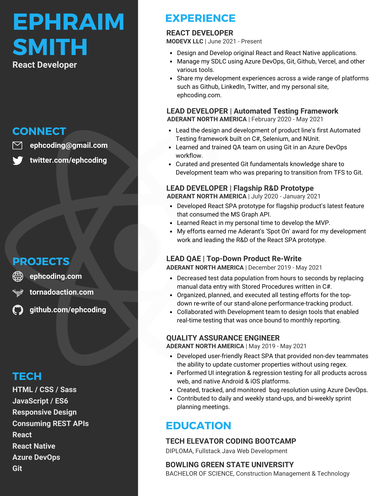

  <a href='https://www.ephcoding.com'>ephcoding.com</a> |
  <a href='https://github.com/ephcoding'>github</a> |
  <a href='https://linkedin.com/in/ephraimjsmith'>linkedin</a> |
  <a href='https://twitter.com/ephcoding'>twitter</a>

 

# **`INDEX`**

1. [Active Projects](#active-projects)
1. [Learning](#learning)
1. [Away From the Computer](#away-from-the-computer)
1. [Connect](#connect)
1. [Resume](#resume)

## **`ACTIVE PROJECTS`**

<em><a href='#index'>--> back to top</a></em>

**I'm giving myself 100 days to complete [FreeCodeCamp](https://freecodecamp.org)'s first 5 Certificates. Started this on a whim on September 24, 2021. Coincidentally, day 100 happens to be January 1, 2022.**

- _check out the [completed projects](https://ephcoding.github.io/freecodecamp) or browse the code right here in [Github](https://github.com/ephcoding/freecodecamp)_

**[ephcoding.com](https://www.ephcoding.com) is my personal site for all things coding. Wanting to keep up with the cool kids, I built it using Next.js.**

- _It's pretty light on content right now as I started my 100-day FreeCodeCamp marathon around the same time I fired up the site._
- _There WILL be more to come..._
- _see the [code](https://github.com/ephcoding/site__ephcoding-dot-com)_

**[tornadoaction.com](https://www.tornadoaction.com) is a for-fun side project that I'm using to apply everything I'm learning right now. Think of it as a 'sandbox with a purpose'.**

- _see the [code](https://github.com/ephcoding/tornado-action)_

## **`LEARNING`**

<em><a href='#index'>--> back to top</a></em>

**In the spirit of biting off more than I can chew, I'm also taking a crack at algo-trading. I'm in the process of picking my first strategy to run with so I can get my feet wet with paper trading and backtesting.**

- _Found the [Alpaca]() broker API earlier this year and have been using their platform to 'dabble' in algo-trading-land._
- _Completed the Udemy course [The Complete Foundation Stock Trading Course](https://www.udemy.com/course/foundation-course/) earlier in the year._
- _Working through the big-boy version of the course now: [Advanced Stock Trading Course + Strategies](https://www.udemy.com/course/advanced-course-plus-strategies/)_

## **`AWAY FROM THE COMPUTER`**

<em><a href='#index'>--> back to top</a></em>

**Quick-Fire rundown of other things I do (did) when not chained to my computer:**

- _Skydives: 127_
- _Bungee Jumps: 2_
- _Miles on Motorcycles: 30,000+_
- _Love music - pretend to play guitar_
  - _built my own custom electric dubbed 'Korina'_
- _Building random shit on an as-needed basis_
  - _latest creation is a sit/stand pump-desk_

## **`CONNECT`**

<em><a href='#index'>--> back to top</a></em>

- Email: ephcoding@gmail.com
- Github: [ephcoding](https://github.com/ephcoding)
- LinkedIn: [ephraimjsmith](https://linkedin.com/in/ephraimjsmith)
- Twitter: [ephcoding](https://twitter.com/ephcoding)

## **`RESUME`**

<em><a href='#index'>--> back to top</a></em>

