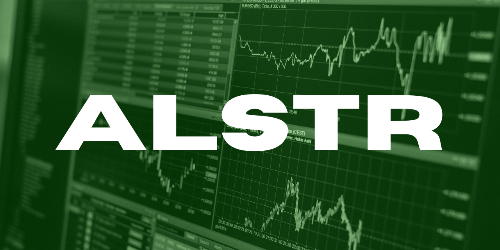

  
  &nbsp;
  &nbsp;
  
  &nbsp;
  &nbsp;
  

 

<table>
  <tr>
    <td>
        
    </td>
    <td>
        
personal stock-trading algorithms

        

          <strong><em>SOURCE <a href='https://github.com/ephbuilding/alstr' target='_blank'>CODE</a></em></strong>
        

    </td>
  </tr>
  <tr>
    <td>
      
    </td>
    <td>
      
wealth is a ratio.  not a dollar amount.

      

        <strong><em>SEE IT <a href='https://relativeincome.com' target='_blank'>LIVE</a></em></strong>&nbsp;&nbsp;&nbsp;&nbsp;&nbsp;
        <strong><em>SOURCE <a href='https://github.com/ephbuilding/relative-income' target='_blank'>CODE</a></em></strong>
      

    </td>
  </tr>
  <tr>
    <td>
        
    </td>
    <td>
        
tornado activity "command center"

        

          <strong><em>SEE IT <a href='https://tornadoaction.com' target='_blank'>LIVE</a></em></strong>&nbsp;&nbsp;&nbsp;&nbsp;&nbsp;<strong><em>SOURCE <a href='https://github.com/ephbuilding/tornadoaction' target='_blank'>CODE</a></em></strong>
        

    </td>
  </tr>
</table>

  
  &nbsp;
  &nbsp;
  
  &nbsp;
  &nbsp;
  

 

  <table>
    <tr>
      <td>
        
      </td>
      <td>
        
      </td>
      <td>
        
      </td>
    </tr>
    <tr>
      <td>
        
      </td>
      <td>
        
      </td>
      <td>
        
      </td>
    </tr>
    <tr>
      <td>
        
      </td>
    </tr>
  </table>

