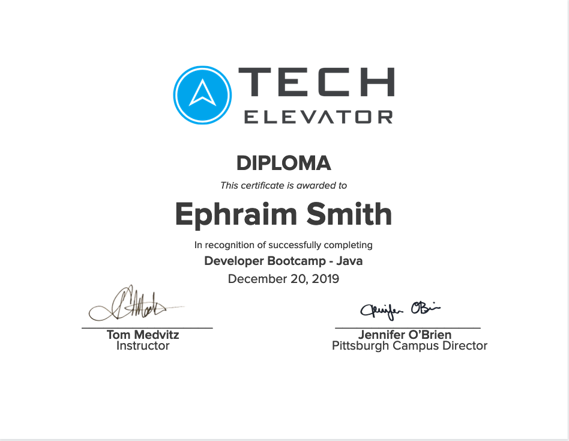

  
  &nbsp;
  &nbsp;
  
  &nbsp;
  &nbsp;
  
  &nbsp;
  &nbsp;
  
  &nbsp;
  &nbsp;
  

# **ACTIVE PROJECTS**

  <table align='center'>
    <tr>
      <td width='400px'>
        
      </td>
      <td>
        <a href='https://tornadoaction.com' target='_blank'>Tornado Action</a> shows you <strong><em>every</em></strong> active tornado alert (warnings & watches) in real-time.  Functionality will expand to include eye-catching data visualizations, up-to-date tornado-related news, and the ability to search every tornado event since 1950!
         
         
        <em>Check it out now at <a href='https://tornadoaction.com' target='_blank'>tornadoaction.com</a>!</em>
         
         
        <em>See the <a href='https://github.com/ephbuilding/tornado-action' target='_blank'>code</a>.</em>
      </td>
    </tr>
    <tr>
      <td width='400px'>
        
      </td>
      <td>
        <a href='https://github.com/ephbuilding/alstr' target='_blank'>ALSTR</a> is an algo-trading execution engine.  The current focus is on developing my own trading strategies and running them in real-time using a paper (fake money) account through <a href='https://alpaca.markets/' target='_blank'>Alpaca</a>.
         
         
        <em>See the <a href='https://github.com/ephbuilding/alstr' target='_blank'>code.</a></em>
      </td>
    </tr>
  </table>

 

# **STACK**

  &nbsp;
  &nbsp;
  &nbsp;
  &nbsp;
  &nbsp;
  &nbsp;
  &nbsp;
  

# **CONTINUED LEARNING**

  <table>
    <tr>
      <td>
              
      </td>      
      <td>
        
      </td>
      <td>
        
      </td>
    </tr>
    <tr>
      <td>
        
      </td>
      <td>
              
      </td>
      <td>
        
      </td>      
    </tr>
    <tr>     
      <td>
        
      </td>      
    </tr>    
  </table>

